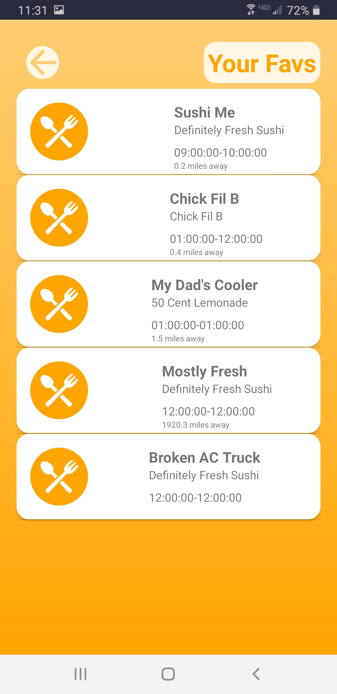

# Team 59 - CurbSide

  

CurbSide provides a way for food truck vendors and mobile eats enthusiasts to connect in a way that is fast, intuitive, and user driven. Users are able to quickly search for and save their favorite food trucks so that they can find them at the drop of a hat, and vendors are given more power to customize and communicate their business’s information to customers. Google integration combined with our customized UI makes for a streamlined user experience that is easy to use and appealing to the eye.

## Team Information

|Item|Value|
|---|:---:|
|Team Number|59|
|Team Name|CurbSide|
|Assigned AI|Gupta, Animesh|
|Platform|Android|
|Description|An application which can be used to find local food trucks.|

## Team Members

### Ashment, Mason (mashment)

### Serrani, Augustus (gserrani)

### Van Fossen, Nick (nvanfoss)

### Morrow, Joseph (joemorro)
